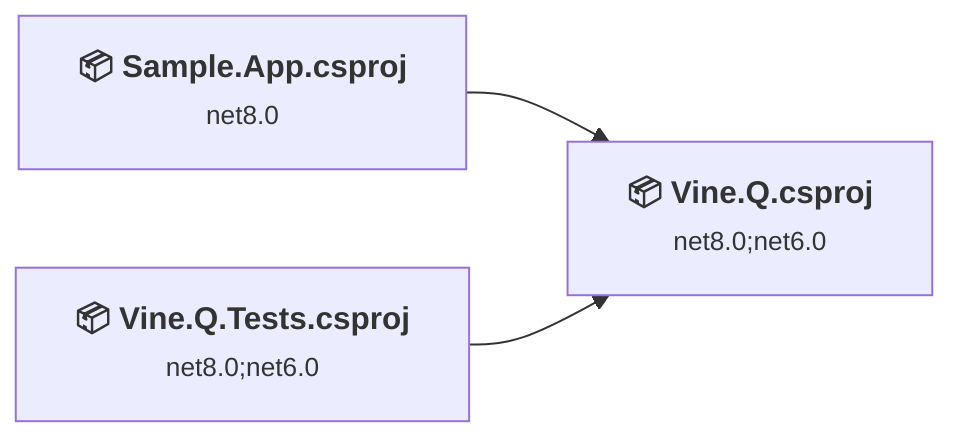
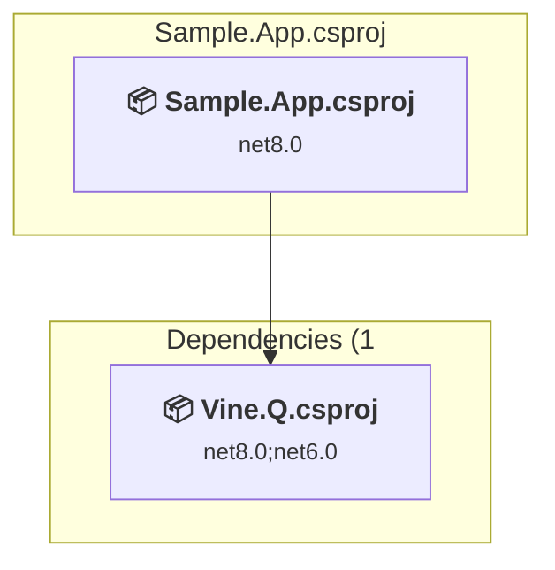
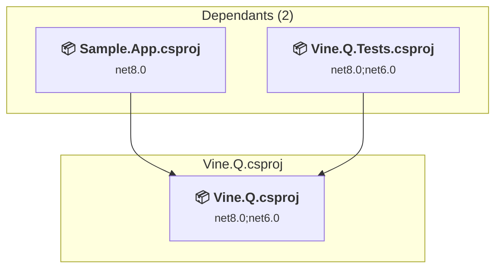
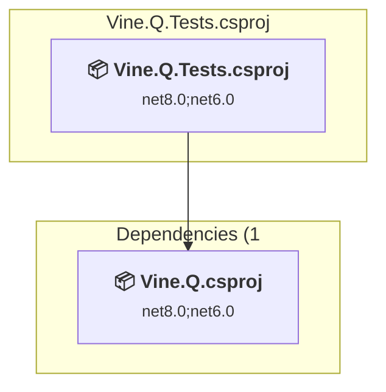

# Projects and dependencies analysis

This document provides a comprehensive overview of the projects and their dependencies in the context of upgrading to .NETCoreApp,Version=v10.0.

## Table of Contents

- [Executive Summary](#executive-Summary)
  - [Highlevel Metrics](#highlevel-metrics)
  - [Projects Compatibility](#projects-compatibility)
  - [Package Compatibility](#package-compatibility)
  - [API Compatibility](#api-compatibility)
  - [Binding Redirect Configuration](#binding-redirect-configuration)
- [Aggregate NuGet packages details](#aggregate-nuget-packages-details)
- [Top API Migration Challenges](#top-api-migration-challenges)
  - [Technologies and Features](#technologies-and-features)
  - [Most Frequent API Issues](#most-frequent-api-issues)
- [Projects Relationship Graph](#projects-relationship-graph)
- [Project Details](#project-details)

  - [src\Sample.App\Sample.App.csproj](#srcsampleappsampleappcsproj)
  - [src\Vine.Q\Vine.Q.csproj](#srcvineqvineqcsproj)
  - [tests\Vine.Q.Tests\Vine.Q.Tests.csproj](#testsvineqtestsvineqtestscsproj)

## Executive Summary

### Highlevel Metrics

| Metric | Count | Status |
| :--- | :---: | :--- |
| Total Projects | 3 | All require upgrade |
| Total NuGet Packages | 20 | 3 need upgrade |
| Total Code Files | 14 |  |
| Total Code Files with Incidents | 5 |  |
| Total Lines of Code | 827 |  |
| Total Number of Issues | 11 |  |
| Estimated LOC to modify | 5+ | at least 0.6% of codebase |

### Projects Compatibility

| Project | Target Framework | Difficulty | Package Issues | API Issues | Binding Issues | Est. LOC Impact | Description |
| :--- | :---: | :---: | :---: | :---: | :---: | :---: | :--- |
| [src\Sample.App\Sample.App.csproj](#srcsampleappsampleappcsproj) | net8.0 | 🟢 Low | 0 | 0 | 0 |  | DotNetCoreApp, Sdk Style = True |
| [src\Vine.Q\Vine.Q.csproj](#srcvineqvineqcsproj) | net8.0;net6.0 | 🟢 Low | 2 | 1 | 0 | 1+ | ClassLibrary, Sdk Style = True |
| [tests\Vine.Q.Tests\Vine.Q.Tests.csproj](#testsvineqtestsvineqtestscsproj) | net8.0;net6.0 | 🟢 Low | 1 | 4 | 0 | 4+ | DotNetCoreApp, Sdk Style = True |

### Package Compatibility

| Status | Count | Percentage |
| :--- | :---: | :---: |
| ✅ Compatible | 17 | 85.0% |
| ⚠️ Incompatible | 1 | 5.0% |
| 🔄 Upgrade Recommended | 2 | 10.0% |
| ***Total NuGet Packages*** | ***20*** | ***100%*** |

### API Compatibility

| Category | Count | Impact |
| :--- | :---: | :--- |
| 🔴 Binary Incompatible | 0 | High - Require code changes |
| 🟡 Source Incompatible | 5 | Medium - Needs re-compilation and potential conflicting API error fixing |
| 🔵 Behavioral change | 0 | Low - Behavioral changes that may require testing at runtime |
| ✅ Compatible | 859 |  |
| ***Total APIs Analyzed*** | ***864*** |  |

## Aggregate NuGet packages details

| Package | Current Version | Suggested Version | Projects | Description |
| :--- | :---: | :---: | :--- | :--- |
| Microsoft.CodeCoverage | 17.11.1 |  | [Vine.Q.Tests.csproj](#testsvineqtestsvineqtestscsproj) | ✅Compatible |
| Microsoft.Extensions.DependencyInjection | 6.0.1 | 10.0.11 | [Vine.Q.csproj](#srcvineqvineqcsproj) [Vine.Q.Tests.csproj](#testsvineqtestsvineqtestscsproj) | NuGet package upgrade is recommended |
| Microsoft.Extensions.DependencyInjection | 8.0.0 |  | [Sample.App.csproj](#srcsampleappsampleappcsproj) | ✅Compatible |
| Microsoft.Extensions.DependencyInjection.Abstractions | 6.0.0 | 10.0.11 | [Vine.Q.csproj](#srcvineqvineqcsproj) [Vine.Q.Tests.csproj](#testsvineqtestsvineqtestscsproj) | NuGet package upgrade is recommended |
| Microsoft.Extensions.DependencyInjection.Abstractions | 8.0.0 |  | [Sample.App.csproj](#srcsampleappsampleappcsproj) | ✅Compatible |
| Microsoft.NET.Test.Sdk | 17.11.1 |  | [Vine.Q.Tests.csproj](#testsvineqtestsvineqtestscsproj) | ✅Compatible |
| Microsoft.TestPlatform.ObjectModel | 17.11.1 |  | [Vine.Q.Tests.csproj](#testsvineqtestsvineqtestscsproj) | ✅Compatible |
| Microsoft.TestPlatform.TestHost | 17.11.1 |  | [Vine.Q.Tests.csproj](#testsvineqtestsvineqtestscsproj) | ✅Compatible |
| Newtonsoft.Json | 13.0.1 |  | [Vine.Q.Tests.csproj](#testsvineqtestsvineqtestscsproj) | ✅Compatible |
| System.Reactive | 6.0.0 |  | [Sample.App.csproj](#srcsampleappsampleappcsproj) [Vine.Q.csproj](#srcvineqvineqcsproj) [Vine.Q.Tests.csproj](#testsvineqtestsvineqtestscsproj) | ✅Compatible |
| System.Reflection.Metadata | 1.6.0 |  | [Vine.Q.Tests.csproj](#testsvineqtestsvineqtestscsproj) | ✅Compatible |
| System.Runtime.CompilerServices.Unsafe | 6.0.0 |  | [Vine.Q.csproj](#srcvineqvineqcsproj) [Vine.Q.Tests.csproj](#testsvineqtestsvineqtestscsproj) | ✅Compatible |
| xunit | 2.9.2 |  | [Vine.Q.Tests.csproj](#testsvineqtestsvineqtestscsproj) | ⚠️NuGet package is deprecated |
| xunit.abstractions | 2.0.3 |  | [Vine.Q.Tests.csproj](#testsvineqtestsvineqtestscsproj) | ✅Compatible |
| xunit.analyzers | 1.16.0 |  | [Vine.Q.Tests.csproj](#testsvineqtestsvineqtestscsproj) | ✅Compatible |
| xunit.assert | 2.9.2 |  | [Vine.Q.Tests.csproj](#testsvineqtestsvineqtestscsproj) | ✅Compatible |
| xunit.core | 2.9.2 |  | [Vine.Q.Tests.csproj](#testsvineqtestsvineqtestscsproj) | ✅Compatible |
| xunit.extensibility.core | 2.9.2 |  | [Vine.Q.Tests.csproj](#testsvineqtestsvineqtestscsproj) | ✅Compatible |
| xunit.extensibility.execution | 2.9.2 |  | [Vine.Q.Tests.csproj](#testsvineqtestsvineqtestscsproj) | ✅Compatible |
| xunit.runner.visualstudio | 2.8.2 |  | [Vine.Q.Tests.csproj](#testsvineqtestsvineqtestscsproj) | ✅Compatible |

## Top API Migration Challenges

### Technologies and Features

| Technology | Issues | Percentage | Migration Path |
| :--- | :---: | :---: | :--- |

### Most Frequent API Issues

| API | Count | Percentage | Category |
| :--- | :---: | :---: | :--- |
| M:System.TimeSpan.FromSeconds(System.Double) | 5 | 100.0% | Source Incompatible |

## Projects Relationship Graph

Legend:
📦 SDK-style project
⚙️ Classic project

## Project Details

### src\Sample.App\Sample.App.csproj

#### Project Info

- **Current Target Framework:** net8.0
- **Proposed Target Framework:** net10.0
- **SDK-style**: True
- **Project Kind:** DotNetCoreApp
- **Dependencies**: 1
- **Dependants**: 0
- **Number of Files**: 1
- **Number of Files with Incidents**: 1
- **Lines of Code**: 73
- **Estimated LOC to modify**: 0+ (at least 0.0% of the project)

#### Dependency Graph

Legend:
📦 SDK-style project
⚙️ Classic project

### API Compatibility

| Category | Count | Impact |
| :--- | :---: | :--- |
| 🔴 Binary Incompatible | 0 | High - Require code changes |
| 🟡 Source Incompatible | 0 | Medium - Needs re-compilation and potential conflicting API error fixing |
| 🔵 Behavioral change | 0 | Low - Behavioral changes that may require testing at runtime |
| ✅ Compatible | 72 |  |
| ***Total APIs Analyzed*** | ***72*** |  |

### src\Vine.Q\Vine.Q.csproj

#### Project Info

- **Current Target Framework:** net8.0;net6.0
- **Proposed Target Framework:** net8.0;net6.0;net10.0
- **SDK-style**: True
- **Project Kind:** ClassLibrary
- **Dependencies**: 0
- **Dependants**: 2
- **Number of Files**: 12
- **Number of Files with Incidents**: 2
- **Lines of Code**: 624
- **Estimated LOC to modify**: 1+ (at least 0.2% of the project)

#### Dependency Graph

Legend:
📦 SDK-style project
⚙️ Classic project

### API Compatibility

| Category | Count | Impact |
| :--- | :---: | :--- |
| 🔴 Binary Incompatible | 0 | High - Require code changes |
| 🟡 Source Incompatible | 1 | Medium - Needs re-compilation and potential conflicting API error fixing |
| 🔵 Behavioral change | 0 | Low - Behavioral changes that may require testing at runtime |
| ✅ Compatible | 654 |  |
| ***Total APIs Analyzed*** | ***655*** |  |

### tests\Vine.Q.Tests\Vine.Q.Tests.csproj

#### Project Info

- **Current Target Framework:** net8.0;net6.0
- **Proposed Target Framework:** net8.0;net6.0;net10.0
- **SDK-style**: True
- **Project Kind:** DotNetCoreApp
- **Dependencies**: 1
- **Dependants**: 0
- **Number of Files**: 3
- **Number of Files with Incidents**: 2
- **Lines of Code**: 130
- **Estimated LOC to modify**: 4+ (at least 3.1% of the project)

#### Dependency Graph

Legend:
📦 SDK-style project
⚙️ Classic project

### API Compatibility

| Category | Count | Impact |
| :--- | :---: | :--- |
| 🔴 Binary Incompatible | 0 | High - Require code changes |
| 🟡 Source Incompatible | 4 | Medium - Needs re-compilation and potential conflicting API error fixing |
| 🔵 Behavioral change | 0 | Low - Behavioral changes that may require testing at runtime |
| ✅ Compatible | 133 |  |
| ***Total APIs Analyzed*** | ***137*** |  |

